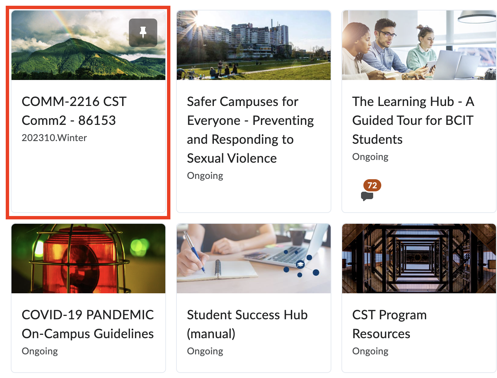

# How To Enroll Into A Group To View Assignemnt

For some courses such as COMP 2714: Relational Database, you may need to join a group within your class to complete group assignments.

1. From the landing page, **Click** on the relevant course that you need to join a group for.

    {width="450"}

2. On the top navbar, **Click** Course Tools to open a dropdown menu.

    {width="450"}

3. **Click** Groups to view all the groups for the course.

    {width="450"}

4. **Click** View Available Groups to get a list of the groups that you and your classmates can join.

    {width="450"}

5. **Click** Join Group for the group you want to join.

    {width="450"}

    !!! info
        You can also see the maximum nmber of people that can be enrolled in each group and check if that group has been filled.

6. **Click** Activities in the navbar to open up a dropdown menu.

    {width="450"}

7. **Click** Assignments to view the Assignment List where you should now see the Group Assignment posted and its corresponding dropbox.

    {width="450"}

    !!! warning
        For assignments that are set to groups, you must **first** join a group in order to view the assignment.

!!! success
    You have successfully enrolled into a group with your classmates and you can view your group assignments.
  
## Conclusion

By the end of this section, will have successfully:

* Enrolled into a Group on Learning Hub
* Access a Group Assignment on Learning Hub

You can now work on your assignment. Good luck!
